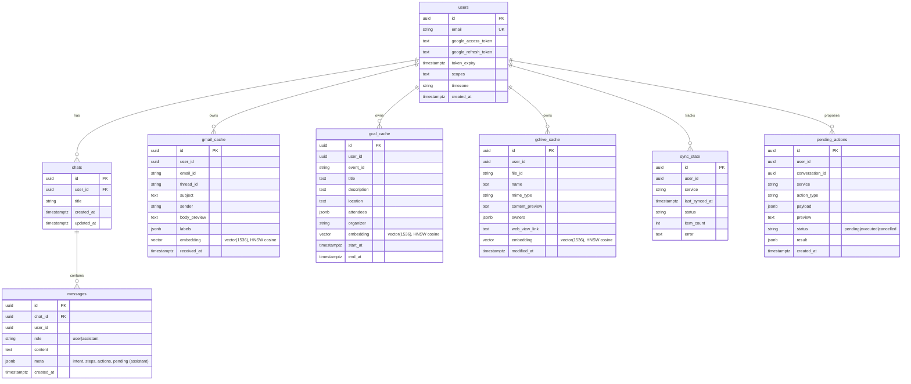

# Data Model (ER)

PostgreSQL + pgvector. `*_cache` tables hold synced Google items with a `vector(1536)` embedding and an
HNSW cosine index. Migrations live in `backend/migrations/` (Alembic).

**Indexes of note**
- `{gmail,gcal,gdrive}_cache_embedding_hnsw` — `USING hnsw (embedding vector_cosine_ops) WITH (m=16, ef_construction=64)`
- B-tree on `sender`, `received_at`, `start_at`, `mime_type`, `modified_at` for the metadata-filter stage
- `UNIQUE(user_id, <external_id>)` per cache table so sync is an idempotent upsert
